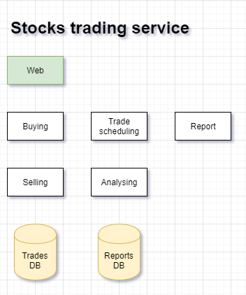

# Stocks trading service using functional decomposition

By using #[[functional-decomposition]] to design a stocks trading service, in let's
lay a microservice architecture, then you might end up with the following
architectural diagram:

